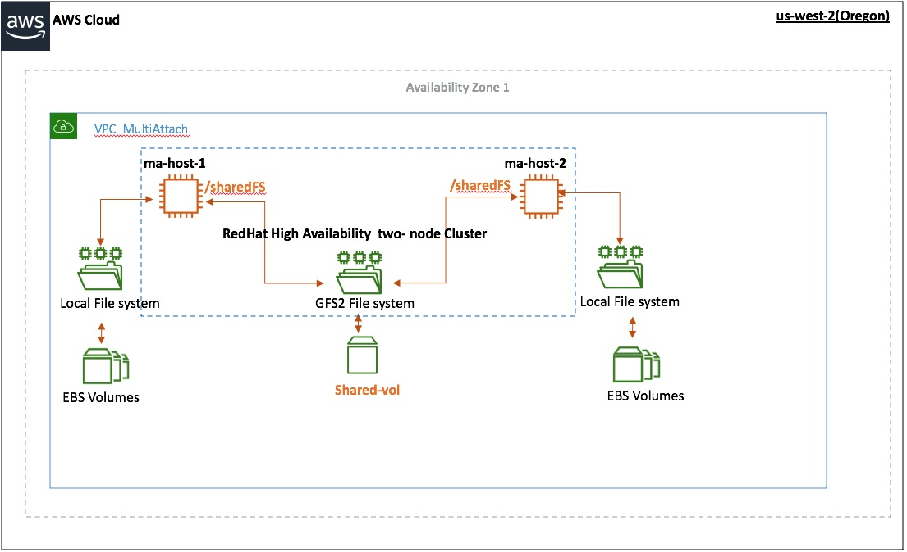
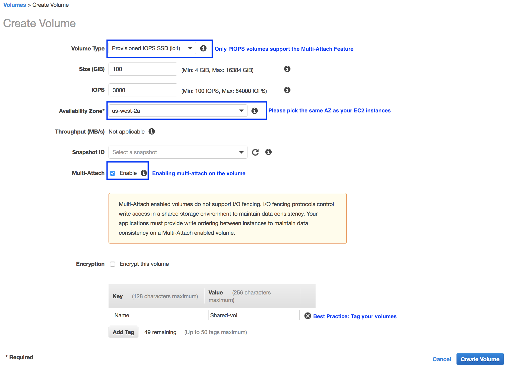
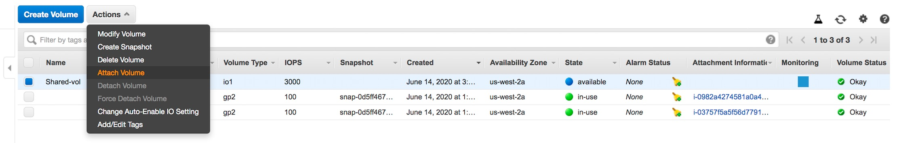

# Access your Multi-Attach EBS volumes across multiple hosts using GFS2
***Suney Sharma, Manager, Partner SA at AWS***
***
One of the design patterns for high availability of mission critical applications is the use of shared storage. This architectural pattern allows the storage volumes to be accessed on multiple hosts at the same time, making the application resilient to node failures. [Amazon Elastic Block Store(EBS)](https://aws.amazon.com/ebs/) volumes can be attached to multiple [Amazon Elastic Compute Cloud (EC2)](https://aws.amazon.com/ec2/) instances using the [Amazon EBS Multi-Attach](https://docs.aws.amazon.com/AWSEC2/latest/UserGuide/ebs-volumes-multi.html) feature. This feature can be used for high availability by using a cluster-aware file system such as GFS2 that safely coordinates storage access between instances to prevent data inconsistencies.   
This blog post walks you through the process of setting up GFS2 using Multi-Attach enabled EBS volumes attached to two EC2 instances which are a part of a Linux cluster.

###  High Level Steps:
1. Setting up EC2 instances and Multi-Attach enabled EBS volumes.
2.	Installing the cluster software.
3.	Configuring the cluster.
4.	Setting up GFS2.

### Setting up EC2 instances and Multi-Attach enabled EBS volumes volumes:
For this post we have used the CentOS 7 AMI available on the AWS marketplace. Our setup will include:
1.	Two EC2 instances (ma-host-1 and ma-host-2) running a Linux cluster.  
2.	Multi-Attach enabled EBS Volume – Shared-vol
3.	GFS2 filesystem mounted as /sharedFS on both nodes. 

***Figure 1: Layout for the use case***

Create the Multi-Attach enabled EBS volume- Navigate to the Create Volume menu in the EBS section of the EC2 console and [create](https://docs.aws.amazon.com/AWSEC2/latest/UserGuide/ebs-volumes-multi.html#enable) a Multi-Attach enabled EBS volume.

***Figure 2: Creating Multi-Attach ENabled EBS volume***

Once the volume has been created successfully, you need to attach it to both the Amazon EC2 instances. This can be done by selecting “Attach Volume” from the Actions button menu in the AWS console.

***Figure 2: Creating Multi-Attach ENabled EBS volume***

